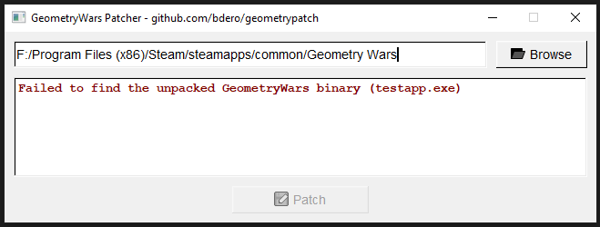
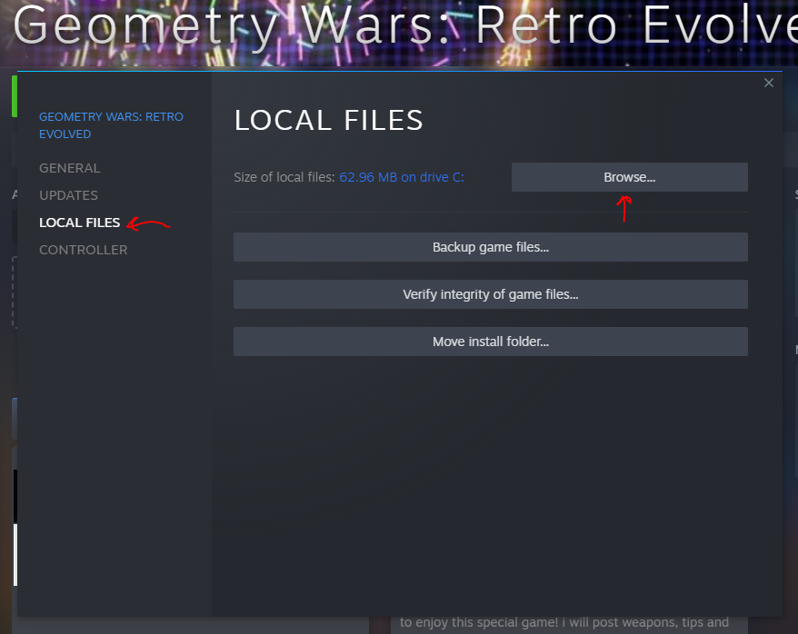
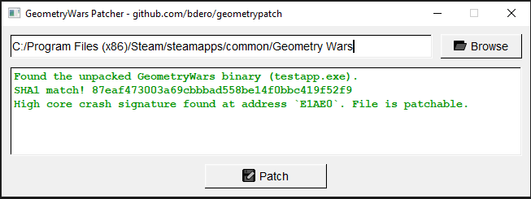

# GeometryWars Patcher

This tool currently addresses two problems:

1. The startup crash for CPUs with a high core count,
   discussed [here](https://steamcommunity.com/app/8400/discussions/0/1643170269579142666/#c1747893804395335610). This
   problem is caused by a buffer overflow in a debug string that lists the properties of each CPU core. This patch null
   terminates the template string early.
2. Incidentally, it also fixes the common "Failed to find Steam"/`Steam.dll` copy issue
   discussed [here](https://steamcommunity.com/app/8400/discussions/0/846938351155039829/) (just
   because `GeometryWars.exe`
   is replaced with `testapp.exe` when patching).

The plan is to add more patches if I find more fixes for common issues.

## How to use

1. [Download](https://github.com/bdero/geometrypatch/raw/master/bin/geometrypatch.exe) the patcher in
   the [bin directory](https://github.com/bdero/geometrypatch/tree/master/bin) of this repository.
2. When you run the patcher, you may see the following error. Just browse to your Geometry Wars steam directory if so:

   

   If you're not sure where your Geometry Wars directory is: Go to your Steam library, right click on "Geometry Wars:
   Retro Evolved" and select "Properties...", then click "LOCAL FILES", then click
   "Browse":

   
3. Once you've browsed for your Geometry Wars directory, just click "Patch".

   
4. That's it! Either run `GeometryWars.exe` or launch it from your Steam library.
5. If you want to undo the patch, just delete the patched `GeometryWars.exe` and rename the
   backup (`GeometryWars.exe.original`).

## Compile from source

### Build requirements

* **Windows XP+** (links `gdiplus`)
* **CMake 3.19+**
* Tested against **MSVC 19.29+ (Visual Studio 2019)**
* *Optional: MinGW & [windows-build-tools](https://www.npmjs.com/package/windows-build-tools)*

### How to build

First, clone this repository with submodules:

```bash
git clone --recursive https://github.com/bdero/geometrypatch.git
```

If you have MinGW or Git Bash and have [windows-build-tools](https://www.npmjs.com/package/windows-build-tools), just
run `build.sh`.

Otherwise, you can just use CMake normally:

1. Make a build directory and generate VS 2019 files in it.

   ```bash
   mkdir build
   cd build
   cmake .. -G "Visual Studio 16 2019" -DCMAKE_BUILD_TYPE=Release
   ```
2. Open `build/geometrypatch.vcxproj` with `Visual Studio 2019` and build the project in release mode.
